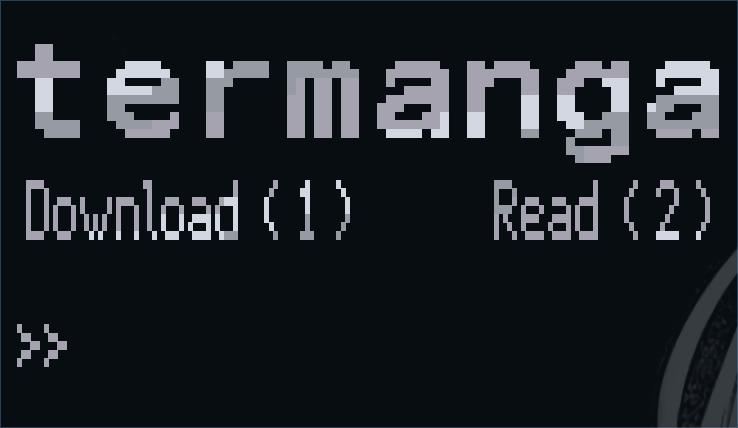
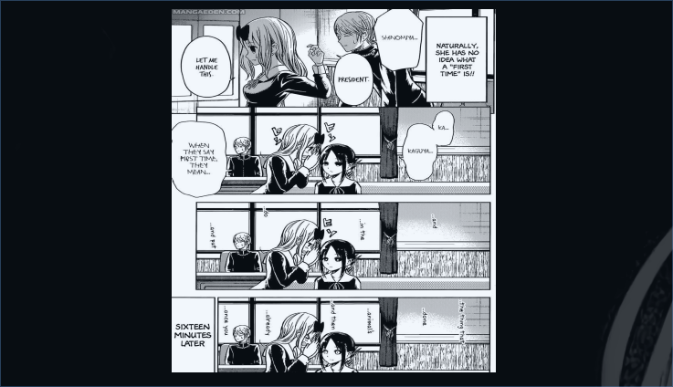

# Termanga
###### A console application to download and read manga written purely in python and bash ♥

## Dependencies
- #### `beautifulsoup4` (py)
- #### `toilet`
- #### `w3m`

## Install
#### Run the following commands
  - ##### `git clone https://github.com/dxmxnlord/termanga`
  - ##### `cd termanga`
  - ##### `make`
  - ##### `sudo make install` *( Note to uninstall run `sudo make uninstall` instead)*

## Usage
### Main menu
  - ##### `1` to download manga
  - ##### `2` to read manga
  - ##### `q` to quit

### Select Manga
  - ##### `right arrow ` to go into the directory
  - ##### `left arrow` to move out of the directory  
  - ##### `1` to download manga
  - ##### `r` to read chapter
  - ##### `q` to quit

### Manga Reader
  - ##### `a` to go one page back
  - ##### `d` to go one page forward
  - ##### `w` to decrease the page height
  - ##### `W` to increase the page height
  - ##### `s` to decrease the page width
  - ##### `S` to increase the page width
  - ##### `r` to reset the page as per the window size and center
  - ##### `c` to reduce the width to one half it's original size
  - ##### `q` to quit
##### ( if the page is a landscape one, and terminal window is half your screen's size, make it full and press *r* )
##### ( if the window is fullscreen, the page will appear stretched so press *c* to bring to the proper size - this won't happen on a half screen terminal )

#### **It is recommended to use a half screen width terminal for reading**

## Future Improvements
#### This is a work in progress project but I'm shelving it for a while ( I'll pick it up if I ever get bored ), so if you're interested in helping out, please do. Some of the stuff I still have to implement is listed out in the `todo.txt` file. Cheers!  
